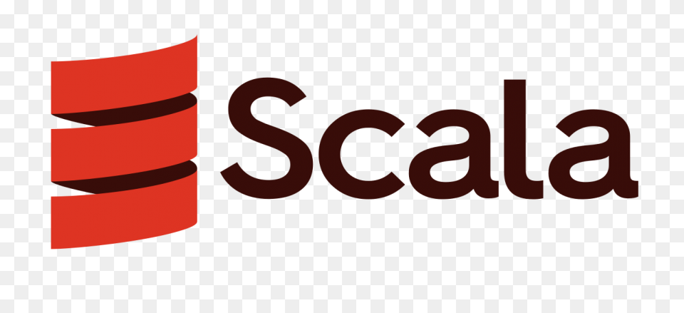

  

# Scala & Functional programming training

My official path to become a **Scala developer** as part of @StuartApp **Devex and Service to Service communications** team's goals following [Scala Rock the Jvm Udemy course](https://www.udemy.com/course/rock-the-jvm-scala-for-beginners/)

Course lectures and exercises -> src/main/scala